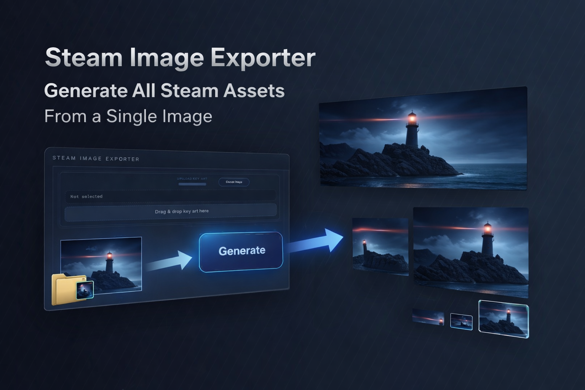

# Steam Image Exporter

English | [日本語](./README.ja.md)



Steam Image Exporter is a desktop app that generates Steam store image sets from a single key art.

Load your source image, optionally add a logo, and export multiple Steam-ready assets at once. The app also includes template previews for logo placement, focus-point control, and preflight checks before export.

## Features

- Generate Steam image assets from a single key art
- Supports `png`, `jpg`, `jpeg`, and `webp` input files
- Drag and drop for logo images
- Automatic background removal for logos
- Template previews for logo placement
- Click-to-set focus point on the preview image
- Preflight checks before export
- GitHub Releases-based update check

## How To Use

1. Launch the app and load your key art.
2. Add a logo image if needed.
3. Click the preview image to set the focus point.
4. Choose an export mode.
5. Select the Steam output targets you want.
6. Click `Generate all Steam images` and choose an output folder.

## Export Modes

- `Fill (crop)`: Recommended. Crops the image to match the target aspect ratio.
- `Fit (black)`: Keeps the full image and fills empty space with black.
- `Fit Extend (blur)`: Keeps the full image and fills empty space with a blurred background.

## Output Targets

| Name | Size |
| --- | --- |
| `header_capsule` | `920x430` |
| `small_capsule` | `462x174` |
| `main_capsule` | `1232x706` |
| `vertical_capsule` | `748x896` |
| `screenshot` | `1920x1080` |
| `page_background` | `1438x810` |
| `library_capsule` | `600x900` |
| `library_hero` | `3840x1240` |
| `library_logo` | `1280x720` |
| `event_cover` | `800x450` |
| `event_header` | `1920x622` |
| `broadcast_side_panel` | `155x337` |
| `community_icon` | `184x184` |
| `client_image` | `16x16` |
| `client_icon` | `32x32` |

Logo-related targets generate both the base image and a separate `_logo` version.

## Development

The app source lives under [`SteamImageExporter/`](./SteamImageExporter).

```bash
cd SteamImageExporter
npm install
npm run dev
```

Build:

```bash
cd SteamImageExporter
npm run build
npm run tauri build
```

## Metadata

App metadata is centralized in `SteamImageExporter/src/config/app-metadata.json`. Before builds, `npm run sync:metadata` synchronizes the values into the related config files.

## Release

Distribution is based on GitHub Releases. When a newer version is available, the app shows `NEW` next to the `Info` button.

## Notes

- All outputs are exported as `png`.
- If no focus point is set, cropping is centered by default.
- Export still works even if update checks fail.
- Steam CI / SteamPipe notes are available in `SteamImageExporter/steam/README.md`.
